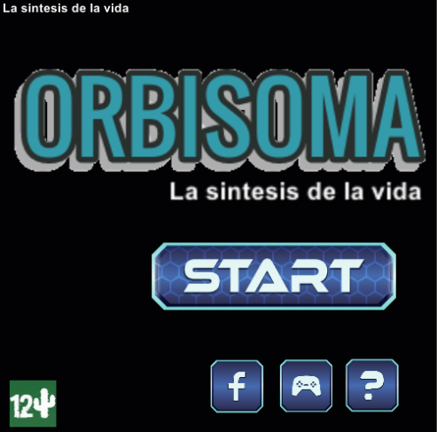
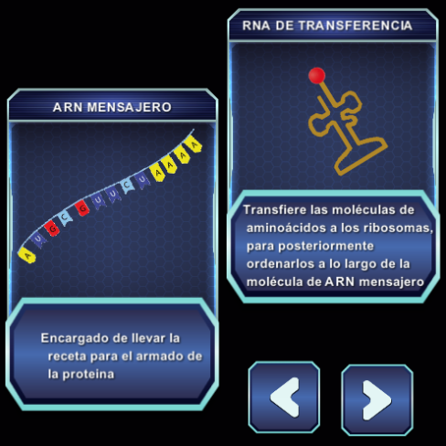
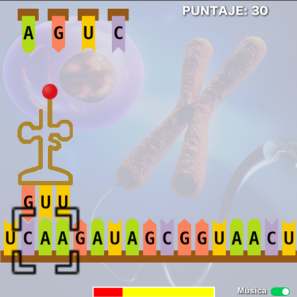
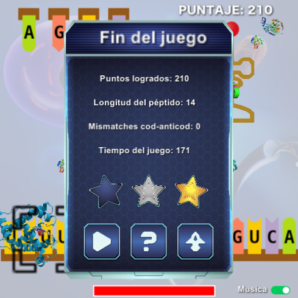
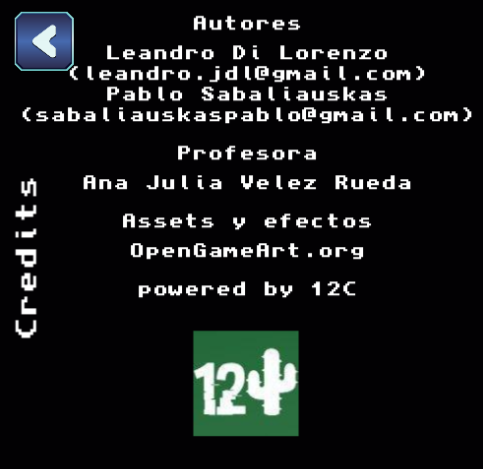

# ORBISOMA

Bienvenidos a ORBISOMA, La síntesis de la vida.

Este juego fue desarrollado por

- Leandro Di Lorenzo » [@leandrojdl](https://github.com/leandrojdl)
- Pablo Sabaliauskas » [@wisaku](https://github.com/wisaku)

Para la materia [Introducción a la Bioinformática](https://github.com/BioinformaticaUNQ)
de la Universidad Nacional de Quilmes.

## El Juego

Para jugarlo, bajar el archivo [ran-proteins-game.pilas](ran-proteins-game.pilas)
y abrirlo con [pilas-engine](https://pilas-engine.com.ar/).

El objetivo del juego es armar los ARN de transferencia para matchear con los
codones que van apareciendo a partir de la cadena de ARN.

A mayor cantidad de ARN de transferencias armados, mayor será el puntaje obtenido
y se ganará más tiempo para seguir armando otros.

Si el ARN de transferencia queda mal formado se pierden puntos.

Primero se llevan los nucleótidos hasta el el ARN de transferencia. Luego de armado
el ARN de transferencia, hay que arrastrarlo hasta el codón indicado en la esquina
inferior izquierda.

### Créditos

